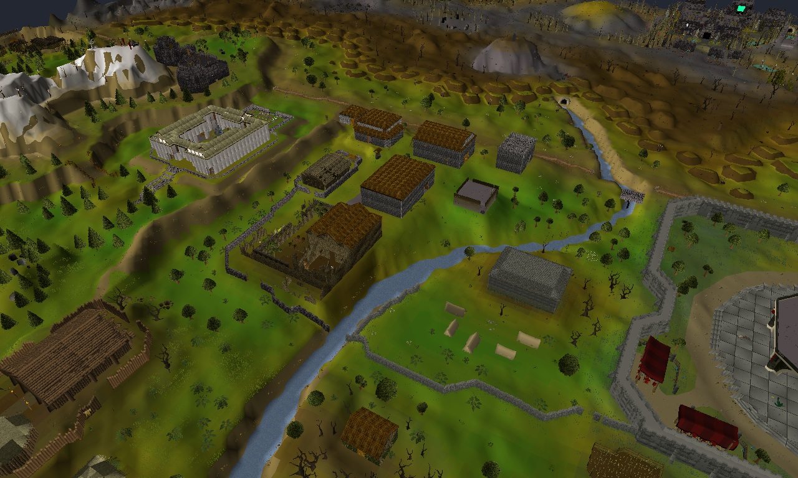

# xrsps-native

A single-window C++20 / Vulkan 1.3 viewer that streams and renders the Old
School RuneScape game world with its per-vertex (Gouraud) lighting - a
native port of a vertical slice of
[XRSPS](https://github.com/xrsps/xrsps-typescript), my from-scratch browser
recreation of Old School RuneScape with a custom WebGL2 renderer written in
TypeScript.

The point of the project is the translation: the same rendering concepts my
WebGL2 renderer implements, re-expressed against an explicit modern API with
every Vulkan call written by hand - no vk-bootstrap, no VMA, no engine.
The source is heavily commented with WebGL2-to-Vulkan notes at every major
concept.



## What's inside

- Full explicit setup: instance, validation layers (debug builds), physical
  device selection, logical device, swapchain with recreation on
  resize/minimize, render pass, depth buffer, graphics pipeline, and
  synchronization with two frames in flight (semaphores + fences).
- Vertex/index/instance buffers uploaded to device-local memory through
  staging buffers with a one-shot transfer command buffer.
- GLSL compiled to SPIR-V at build time (glslc); per-vertex colors carry
  the game's baked hillshade lighting and are interpolated across faces
  (Gouraud) - the OSRS look.
- Per-frame-in-flight uniform buffers (persistently mapped) fed by an
  orbit camera.
- Translucent scenery (spider webs, waterfalls, portals): the models'
  per-face alpha feeds a second pipeline with blending on and depth writes
  off, drawn after the opaque pass.
- Animated scenery (fires, flags, water wheels): a port of the game's
  seq/frame/framemap animation stack, applied with the client's exact
  fixed-point transforms. Every animation frame is pre-built into its own
  vertex/index buffers when a map square loads, so at draw time an
  animation is just a different buffer binding picked by the wall clock -
  zero uploads per frame.
- Screenshot capture (`F2`, or `--screenshot` for scripted runs) by copying
  the swapchain image into a host-visible buffer.

- The world comes from a real OSRS cache dump (JS5 `main_file_cache.dat2`
  + `.idx` files, e.g. from an OpenRS2 archive, placed in `cache/` - game
  assets are never committed): actual game terrain plus scenery, decoded by
  a from-scratch C++ port of the cache stack: sector
  store, gzip/bzip2 containers, XTEA, reference tables, map decoding,
  underlay blending, tile shapes, the game's HSL palette and integer
  hillshade lighting, loc configs, seq/frame/framemap animation data, the
  classic/V2/V3 model formats with per-vertex Gouraud lighting, and
  sampled game textures (sprites decoded
  into a texture array; leaves and fences use alpha cutout) - producing a
  scene that matches the game. Map squares stream in and out around the
  camera as you fly (WASD / RMB-drag), so the whole world map is reachable;
  `--map <mx,my>` picks the starting square (default: Edgeville) and
  `--radius <n>` the streaming radius. Each square is built with its eight
  neighbours as decode context, which keeps color blending and lighting
  seamless across chunk borders.

Non-goals, kept out deliberately: NPCs and players, per-face depth sorting
of translucent geometry, shadow mapping.

## Controls

| Input          | Action                                   |
| -------------- | ---------------------------------------- |
| Drag LMB       | Orbit the camera                         |
| Drag RMB       | Pan across the ground plane              |
| `WASD`         | Fly across the world                     |
| Scroll wheel   | Zoom                                     |
| `F2`           | Save `screenshot.ppm`                    |
| `ESC`          | Quit                                     |

CLI flags (all optional): `--screenshot <path>`, `--frames <n>`,
`--yaw <deg>`, `--pitch <deg>`, `--dist <units>`, `--cache <dir>`,
`--map <mx,my>`, `--radius <n>`, and `--self-test` (scripted
resize/minimize/restore/screenshot run whose exit code reflects the
validation-layer message count - the CI version of "runs clean").

## Building

Dependencies: CMake 3.21 or newer, a C++20 compiler, and the
[Vulkan SDK](https://vulkan.lunarg.com/) (headers, loader, `glslc`,
validation layers). Everything else (GLFW, GLM, zlib, bzip2) is found on the
system when installed, otherwise downloaded as source archives and built
automatically - no git or package manager required.

Debug builds enable the validation layers; the app prints every layer
message and exits non-zero if any occurred.

### Windows (Visual Studio 2022)

1. Install Visual Studio 2022 with the *Desktop development with C++*
   workload. If CMake wasn't included, add the *C++ CMake tools for Windows*
   component (or `winget install Kitware.CMake`).
2. Install the [Vulkan SDK](https://vulkan.lunarg.com/) (sets `VULKAN_SDK`,
   ships `glslc` and the validation layers).

Then from an x64 Native Tools Command Prompt for VS 2022:

```bat
cmake -S . -B build-win
cmake --build build-win --config Release
build-win\Release\xrsps-native.exe
```

(Use `--config Debug` to run with the validation layers enabled.)

`build_win.bat` does the same in one step and launches the viewer;
arguments are passed through, e.g. `build_win.bat --radius 3`.

### Linux

```sh
# Debian/Ubuntu package names:
sudo apt install cmake g++ libvulkan-dev glslc vulkan-validationlayers libglfw3-dev libglm-dev
cmake -S . -B build            # defaults to Debug (validation ON)
cmake --build build -j
./build/xrsps-native
```

Screenshots are written as binary PPM; convert with anything
(`magick screenshot.ppm screenshot.png`, GIMP, etc.).

## What changed coming from WebGL2

The four shifts that reshape how you think, each marked with comments at the
exact call sites:

**Explicit memory management.** WebGL2's `gl.bufferData(..., STATIC_DRAW)`
was a *hint*; the browser decided where the bytes lived and when they moved.
In Vulkan, memory is its own object: every buffer/image is created, then
backed by memory you allocate from an explicitly chosen heap
(`findMemoryType` intersects what the resource allows with what you want),
then bound. Getting geometry into VRAM is a hand-written pipeline: map a
host-visible staging buffer, memcpy into it, record a GPU copy, then wait
on a fence (`createDeviceLocalBuffer` in `renderer.cpp`). In production you'd use VMA
and sub-allocate from large blocks; the comments mark where.

**Pipeline state objects vs. per-draw state.** WebGL2 is a state machine:
`gl.enable(DEPTH_TEST)`, `gl.cullFace`, `gl.useProgram`,
`vertexAttribPointer` - all mutable, all checked at draw time, with the
driver recompiling hidden pipeline variants when combinations changed (the
classic first-use hitch).
Vulkan bakes shaders + vertex layout + rasterizer + depth + blend state into
one immutable `VkPipeline`, compiled at a moment we control. State you want
mutable must be opted out explicitly (viewport/scissor are dynamic here so
resizing doesn't rebuild the pipeline).

**Command buffers vs. immediate draw calls.** `gl.drawElements` looked
immediate (the browser actually batched behind your back). Vulkan makes the
batch a first-class object: work is *recorded* into a command buffer, then
*submitted* to a queue, and nothing executes until then. This is what makes
multi-threaded rendering natural - recording is just writing into per-thread
memory.

**Explicit synchronization.** The biggest one. WebGL2 rendering "just
worked" because the driver inserted every hazard barrier and stalled you
when you outran the GPU. Vulkan hands you the primitives: semaphores
order work GPU-side (acquire, render, present), fences let the CPU
wait for the GPU (frame-slot reuse), and pipeline barriers order memory
accesses within a queue (the screenshot copy). Two frames in flight - the
CPU recording frame N+1 while the GPU renders frame N - exists in this code
as two sets of per-frame resources and one `vkWaitForFences` at the top of
`drawFrame`, instead of as an invisible driver policy.

## Code tour

| File               | Contents                                                        |
| ------------------ | --------------------------------------------------------------- |
| `src/main.cpp`     | Window, input callbacks, frame loop, chunk streaming, CLI flags, self-test |
| `src/renderer.h/.cpp` | All Vulkan: init chain, swapchain lifecycle, frame path, screenshot, buffer helpers |
| `src/camera.h/.cpp` | Orbit camera; owns the Vulkan clip-space corrections           |
| `src/model.h`      | The `Model`/`Vertex` contract between world building and the renderer |
| `src/cache.h/.cpp` | JS5 cache reader: sector store, gzip/bzip2 containers, XTEA, reference tables |
| `src/world.h/.cpp` | Map/terrain decoding, loc models + animation, palette + hillshade lighting, chunk building |
| `shaders/model.vert/.frag` | Gouraud lighting; compiled to SPIR-V by CMake           |

## License

MIT - see [LICENSE](LICENSE).
